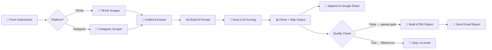
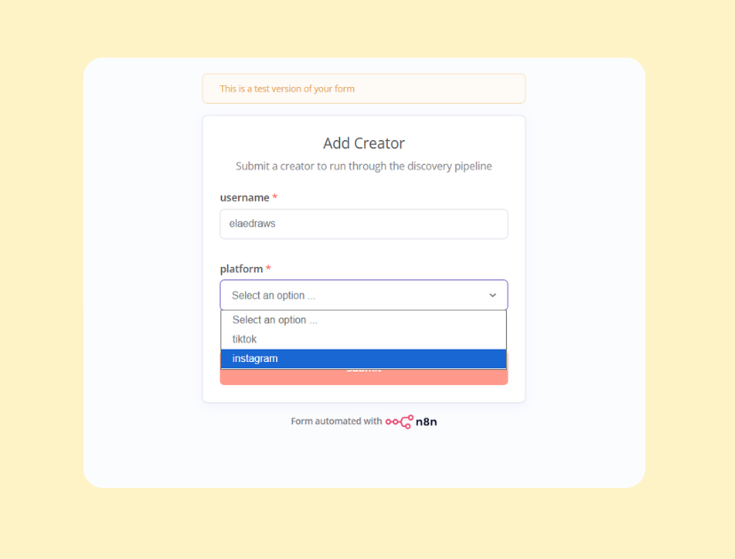
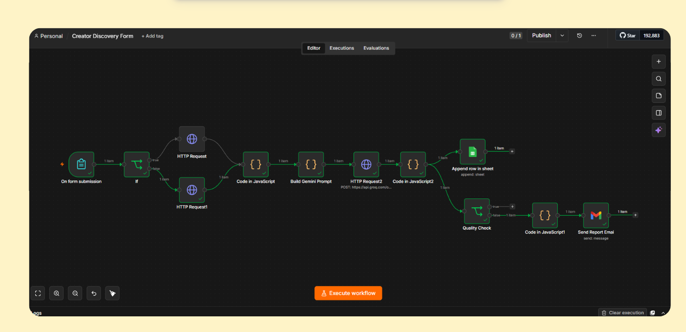
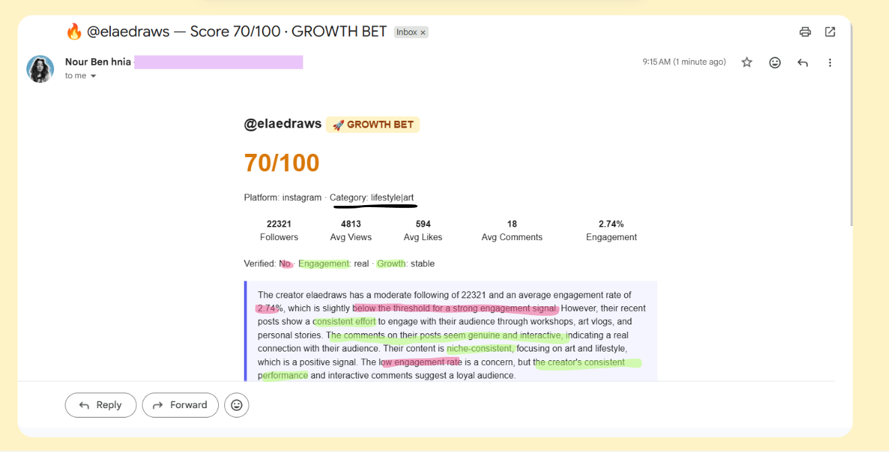
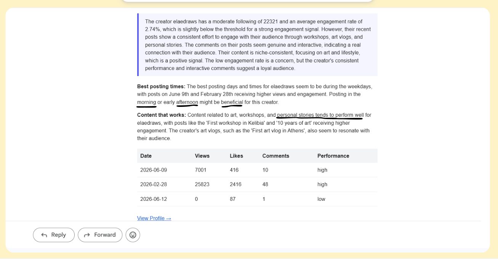

  
  
  
  
  
  

An automated pipeline that scouts, scores, and reports on TikTok/Instagram creators for influencer outreach — submit a username, get a scored report in your inbox.

---

## 📋 Overview

Submit a creator's username and platform through a form. The workflow scrapes their public profile and recent posts, scores them with an AI model using platform-specific criteria, logs every result to a Google Sheet, and automatically emails a formatted report for any creator who clears the quality bar.

## ⚙️ How It Works

## 📝 Using the Form

Fill in the creator's `username` and pick their `platform` from the dropdown — TikTok or Instagram only — then submit.

## 📦 Importing the Workflow

1. Open n8n → **Workflows**
2. Click the **(...)** menu top-right → **Import from File** (or drag `workflow.json` straight onto a blank canvas)
3. Connect your own credentials for: ScrapeCreators (Header Auth, `x-api-key`), Groq (Bearer Auth), Google Sheets (OAuth2), and Gmail (OAuth2)

## 🗂️ Tracking Sheet Schema

Every creator submitted through the form — whether or not they pass the quality gate — gets logged as a row in the Google Sheet, with these columns:

| Column | Description |
|---|---|
| `username` | Creator's handle |
| `platform` | tiktok or instagram |
| `followers` | Follower count |
| `avg_views` | Average views across last 10 posts |
| `avg_likes` | Average likes across last 10 posts |
| `avg_comments` | Average comments across last 10 posts |
| `engagement_rate` | (avg likes + avg comments) / followers |
| `is_verified` | Platform verification badge status |
| `is_business` | Business/creator account status |
| `category` | AI-classified content niche |
| `strategic_tier` | SAFE BET / GROWTH BET / EXPERIMENTAL-VIRAL BET |
| `score` | AI-generated score, 0–100 |
| `outreach_priority` | low / medium / high |
| `contacted` | Manual outreach status tracker |
| `profile_link` | Direct link to the creator's profile |
| `last_updated` | Timestamp of the scoring run |

## 🚦 Quality Check Logic

Not every scraped creator gets emailed — only ones that clear a score/priority threshold. The condition checks `score < 60 AND priority == "low"`; when that evaluates **false** (the creator is decent), the item continues to the email step. When it's **true** (genuinely low quality), it's dropped silently with no email sent.

## 📬 Example Output

Here's a real run: `@elaedraws`, an Instagram art/lifestyle creator, was submitted through the form. The pipeline came back with a **Score of 70/100** and a **GROWTH BET** tier — based on 22.3K followers, a 2.74% engagement rate, and consistent (if not viral) post performance.

The AI also flagged practical, actionable detail: best posting times landed on weekday mornings and early afternoons, and the content that performed best was workshop recaps and personal-story style posts — backed up by a post-by-post breakdown showing exactly which dates and posts drove the highest views and engagement.

## 🧰 Tech Stack

| Layer | Tool |
|---|---|
| Orchestration | n8n |
| Data source | ScrapeCreators API |
| AI scoring | Groq — Llama 3.3 70B |
| Storage | Google Sheets |
| Delivery | Gmail |

> [!WARNING]
> The ScrapeCreators TikTok profile endpoint doesn't return per-post data the way the Instagram endpoint does, so TikTok creators are currently scored with less post-level detail.

> [!CAUTION]
> If a scraper request returns no usable profile (private account, typo, expired API credits), the workflow throws a clear error instead of silently passing empty data downstream into the AI scoring step.

---

